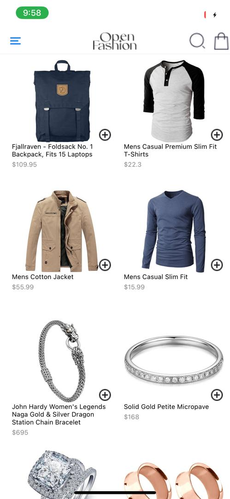
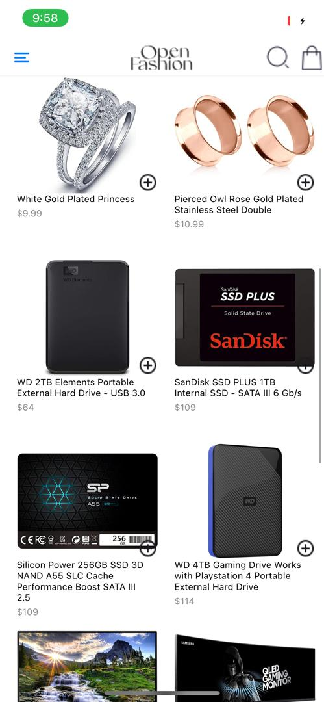
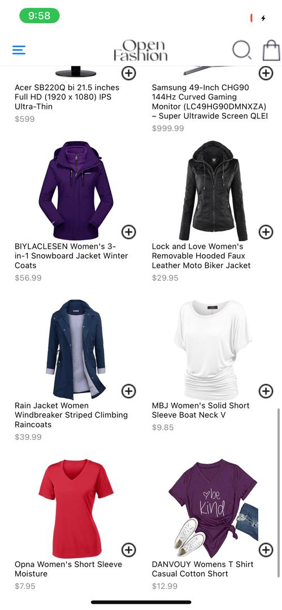
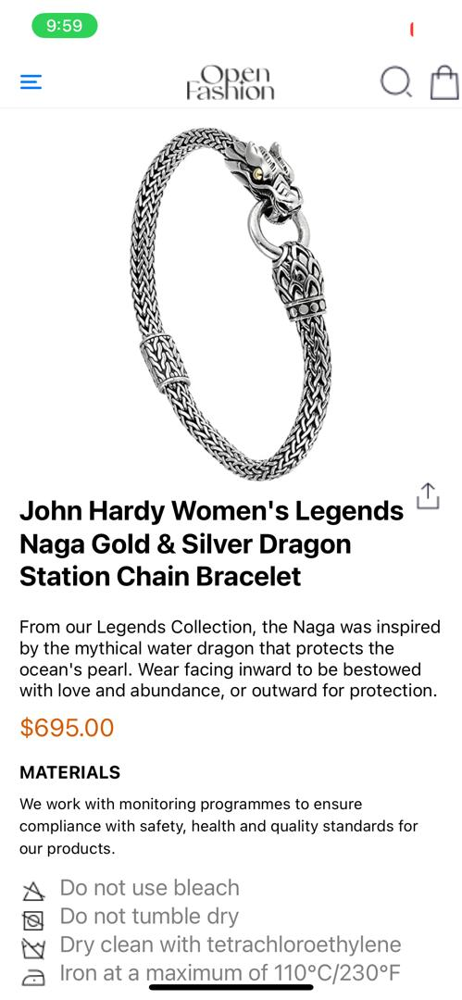
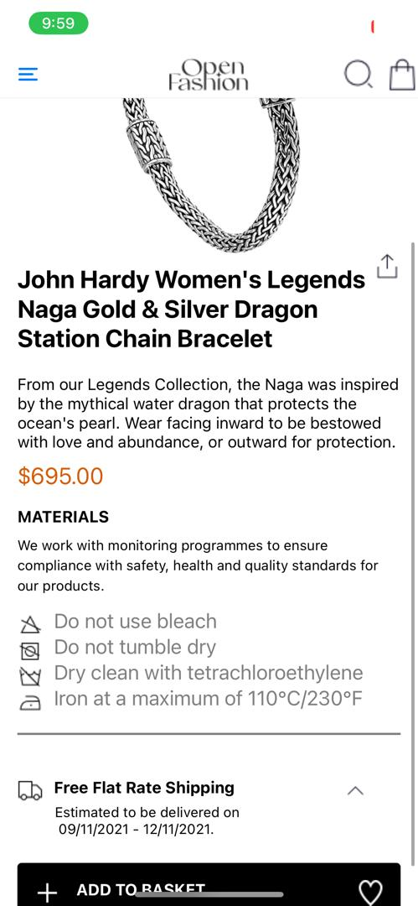
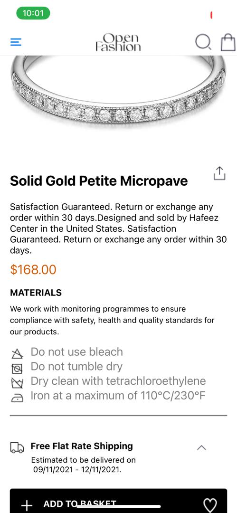
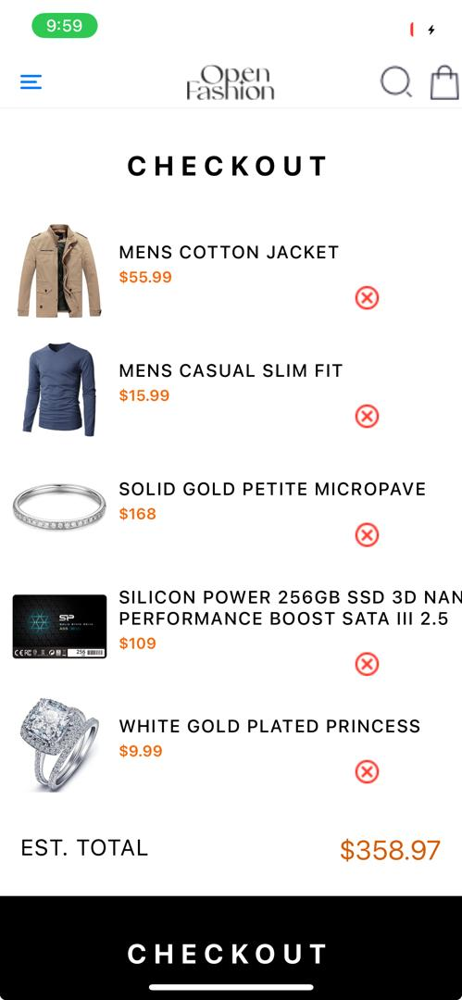
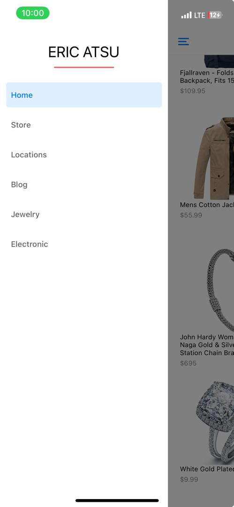

# rn-assignment7-11348827

# Elsie Loise Amegavi

This React Native project is an e-commerce application that features a product catalogue, product detail view, and a checkout page. The app allows users to browse products, view detailed information, add them to a cart, and manage the cart items.

## Project Structure

The app contains the following main pages, navigated using React Navigation's stack and drawer navigators:

### HomePage.js

The `HomePage.js` page displays a catalogue of products in a grid format. Users can add products to the cart, and the cart items are stored using `AsyncStorage`.

**Features:**

- **Product Catalogue:** Displays a list of products with images, titles, descriptions, and prices.
- **Add to Cart:** Allows users to add products to the cart. If the product is already in the cart, it is not added again.
- **Navigation to Checkout:** Provides a button to navigate to the checkout page.
- **View Product Details:** Clicking on a product image redirects users to the product details page.

**Components:**

- `ProductItem`: Displays individual product details with an "Add to Cart" button.
- `FlatList`: Renders products in a grid format.

### ProductDetailScreen.js

The `ProductDetailScreen.js` page displays detailed information about a selected product. The data is fetched from an external API.

**Features:**

- **Product Information:** Shows the selected product's image, title, description, and price.
- **Add to Cart Button:** Allows users to add the product to their cart from the details page.

**Components:**

- `Image`: Displays the product image.
- `Text`: Displays the product title, description, and price.

### CheckoutPage.js

The `CheckoutPage.js` page displays the items in the cart. Users can remove items from the cart, and the cart items are updated in `AsyncStorage`.

**Features:**

- **View Cart Items:** Displays the list of products added to the cart.
- **Remove from Cart:** Allows users to remove products from the cart. The updated cart is stored in `AsyncStorage`.
- **Header:** Contains logo and search icons.

**Components:**

- `CartItem`: Displays individual cart items with images, titles, descriptions, and prices.
- `Remove Button`: Allows removal of products from the cart.

### DrawerNavigator.js

The `DrawerNavigator.js` integrates drawer navigation for easy access to additional pages like Store, Location, Blog, Jewelry, and Electronics. Each drawer item redirects to its respective page.

**Features:**

- **Drawer Navigation:** Provides access to different categories of products.
- **Headers for Each Page:** Displays a header specific to each drawer item.

